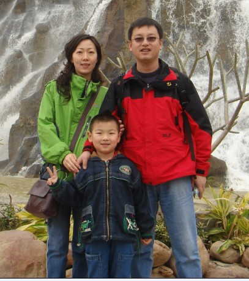
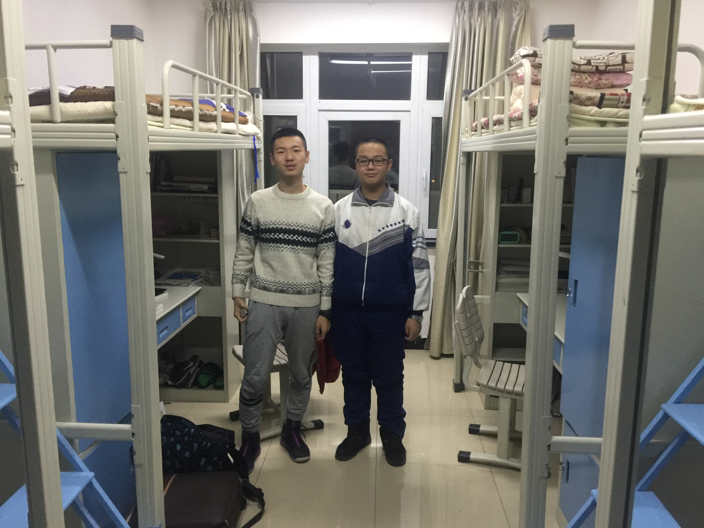
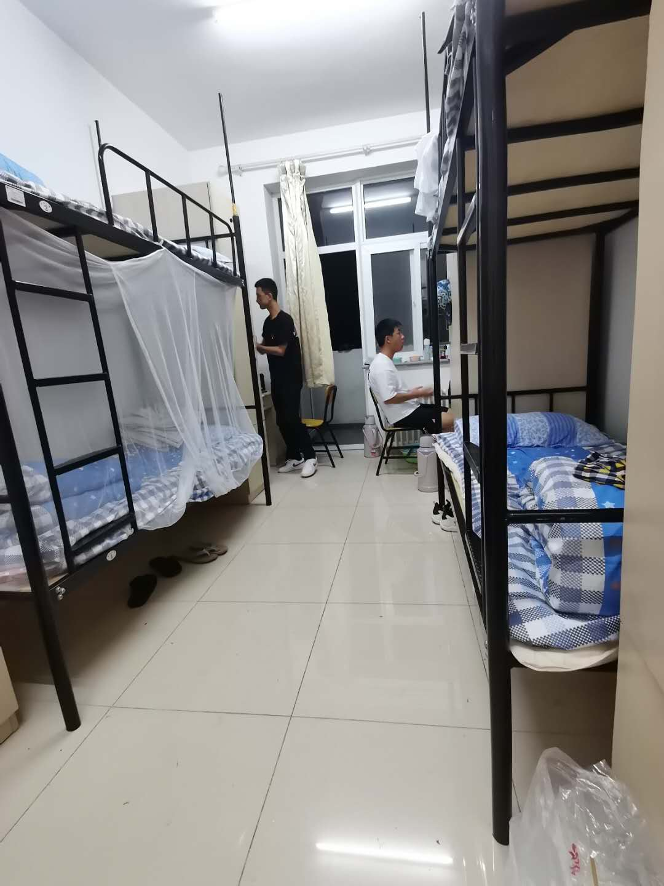

## Welcome to WXSX(王小帅轩）'s Web

<h1><b>基本信息</b></h1>

<b>姓名：</b>王辰轩、<b>性别：</b>男、<b>民族：</b>俄罗斯族、<b>身高：</b>176(略矮）、<b>体重：</b>64公斤

 
<h1><b>成长经历</b></h1> 
<h2><b>家庭</b></h2>

 
我有一个幸福美满的家庭，爸爸和妈妈都是国企单位的员工。爷爷奶奶和姥姥姥爷身体都很健康，住的离我家也很近，我时常去老人家蹭饭，嘿嘿。
我有一个大我两岁的表哥，从小就和我一起长大，我们感情很好，现在他在国外读大学，我们也经常联系。
 
<h2><b>学习</b></h2>

 
作为新疆人的我，小学和初中都是在家附近上的，学习很努力，爸爸妈妈也很操心我的学习和成长。就这样，我很幸运地考上了全新疆最好的高中-乌鲁木齐市第一中学。在那里，我享受着最好的学习环境，
  遇到了最好的老师和同学，和大家一起同甘共苦了三年的时光，我感到每一天都过得充实而幸福。

  
考上PKU，是每一个人梦寐以求的事。终于，我也成为万千学子羡慕的对象。初入燕园，偌大的校园，优美的园林风光，现代化的的教学楼，气派的图书馆，琳琅满目的饭菜，可爱的猫咪……这些都令我瞬间爱上了北大，爱上了燕园。经过一个月的学习生活，真的是感慨万千。热心的室友，操心的班主任，用心的任课老师，细心的班委，他们的默默付出让我在燕园感受到的不仅是优质的教育资源，更感受到了与志同道合的人一起朝着目标奋斗的快乐！
  
  
 
 
高中宿舍和大学宿舍
 
 
