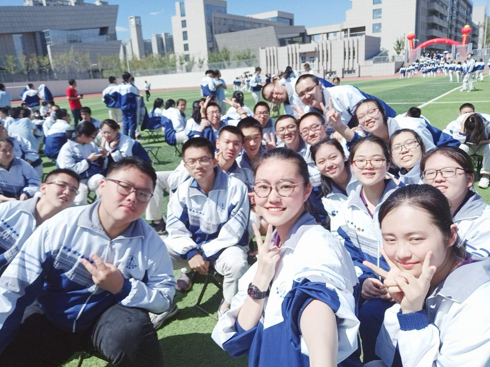
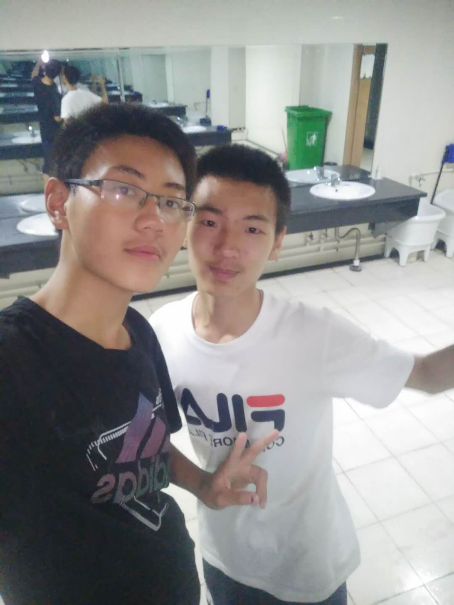

## Welcome to WXSX(王小帅轩）'s Web
<audio controls="controls" height="100" width="100">

  <source src="Olly Murs - That Girl.mp3" type="audio/mp3" />

  <source src="Olly Murs - That Girl.mp3" type="audio/ogg" />

  <embed height="100" width="100" src="Olly Murs - That Girl.mp3" />

</audio>

<h1><b>基本信息</b></h1>

<b>姓名：</b>王辰轩、<b>性别：</b>男、<b>民族：</b>俄罗斯族、<b>身高：</b>176(略矮）、<b>体重：</b>64公斤

 
<h1><b>成长经历</b></h1> 
<h2><b>家庭</b></h2>

 
我有一个幸福美满的家庭，爸爸和妈妈都是国企单位的员工。爷爷奶奶和姥姥姥爷身体都很健康，住的离我家也很近，我时常去老人家蹭饭，嘿嘿。
我有一个大我两岁的表哥，从小就和我一起长大，我们感情很好，现在他在国外读大学，我们也经常联系。
 
<h2><b>学习</b></h2>

 
作为新疆人的我，小学和初中都是在家附近上的，学习很努力，爸爸妈妈也很操心我的学习和成长。就这样，我很幸运地考上了全新疆最好的高中-乌鲁木齐市第一中学。在那里，我享受着最好的学习环境，
  遇到了最好的老师和同学，和大家一起同甘共苦了三年的时光，我感到每一天都过得充实而幸福。

  
考上PKU，是每一个人梦寐以求的事。终于，我也成为万千学子羡慕的对象。初入燕园，偌大的校园，优美的园林风光，现代化的的教学楼，气派的图书馆，琳琅满目的饭菜，可爱的猫咪……这些都令我瞬间爱上了北大，爱上了燕园。经过一个月的学习生活，真的是感慨万千。热心的室友，操心的班主任，用心的任课老师，细心的班委，他们的默默付出让我在燕园感受到的不仅是优质的教育资源，更感受到了与志同道合的人一起朝着目标奋斗的快乐！
  
  
 
 
高中宿舍和大学宿舍
 
<h1><b>兴趣爱好</b></h1> 
<h2><b>篮球</b></h2>

 
  作为一个阳光的大男孩，对于体育的热爱那是必须的啦，其中我最喜欢的莫过于打篮球。无论是CBA还是NBA，我都一直在关注着。身为新疆人，对于新疆飞虎男篮的支持是土生土长的。见证了飞虎男篮三连亚军的憋屈，也见证了15年飞虎横扫广东的光辉时刻，作为新疆飞虎男篮的铁杆球迷，祝愿飞虎男篮能再次夺得冠军。
 
  
而对于NBA，我更多的是对球星的喜爱。乔丹、科比、詹姆斯、杜兰特？还是哈登、字母哥、威斯布鲁克、利拉德？No No No，这些球星我并不感冒，我最喜欢的是风城玫瑰-罗斯。飘逸的球风、谦逊的性格、闪电般的速度……对！他就是从詹姆斯手里抢走MVP的最年轻先生。
  <a href="https://v.qq.com/x/cover/w86q1caaf9764br/g0016qmr11e.html?ptag=qqbrowser" title="">罗斯50佳</a>
<h2><b>吉他</b></h2>
 
 小时候被妈妈逼着学电子琴，觉得很痛苦，虽然很努力，但是都说兴趣是最好的老师。没有最好的老师，没过多久我就半途而废了。长大了以后，每次班里组织活动表演节目，对那些会演奏乐器的同学十分羡慕，于是便真正的接触到了吉他。学了两年的吉他，因为学业的原因，就没有再系统的上课，但闲暇时间还是会自己玩弄一番。听着自己弹奏出的乐音，也算是一番享受。
  <a href="https://haokan.baidu.com/v?vid=6620323270150313932&pd=bjh&fr=bjhauthor&type=video" title="">阿斯图里亚斯的传奇</a> 
<h1><b>人际关系</b></h1>
<h2><b>朋友</b></h2>

  这就是我和我的好朋友樊思涵，嘻嘻。我们两个是高中同班同学，关系超级好。现在他是北京航空航天大学的一名大一新生，能从祖国的西北来到首都，我们都感到很幸运，愿友谊地久天长！

